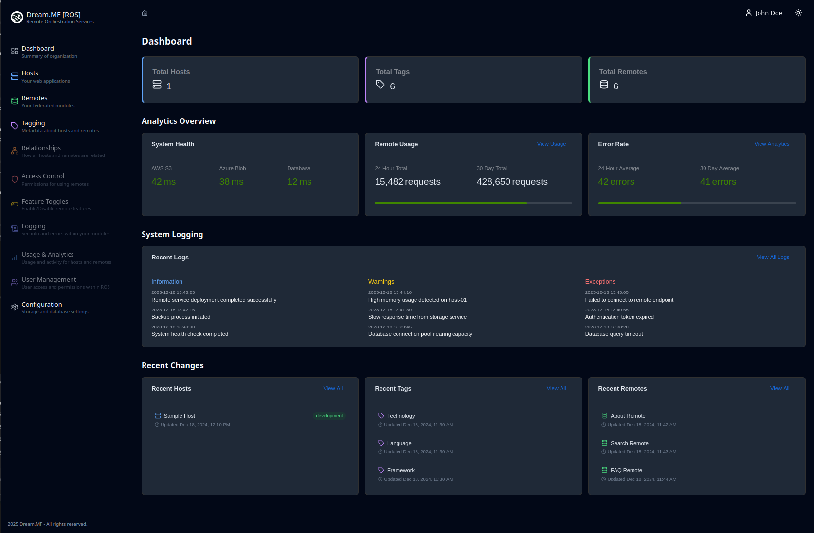
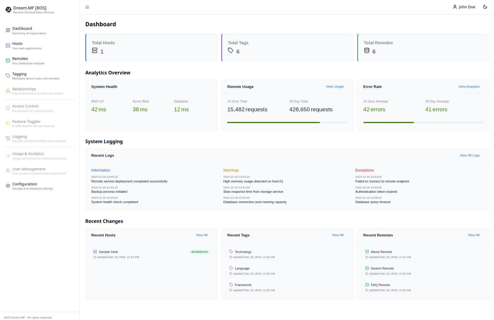
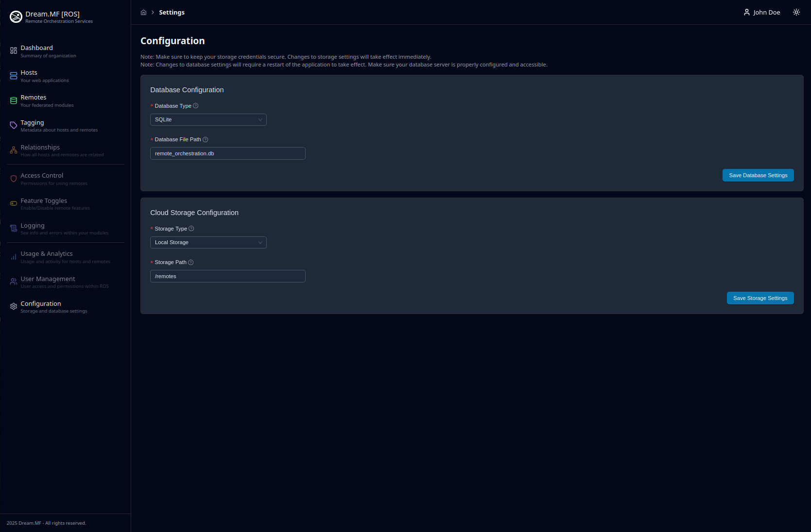
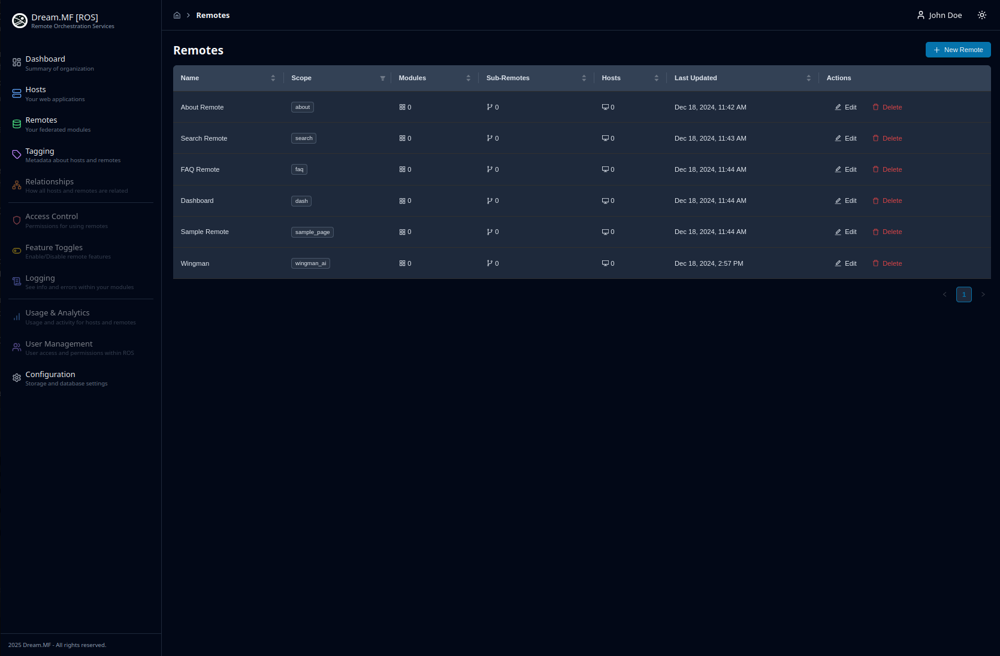
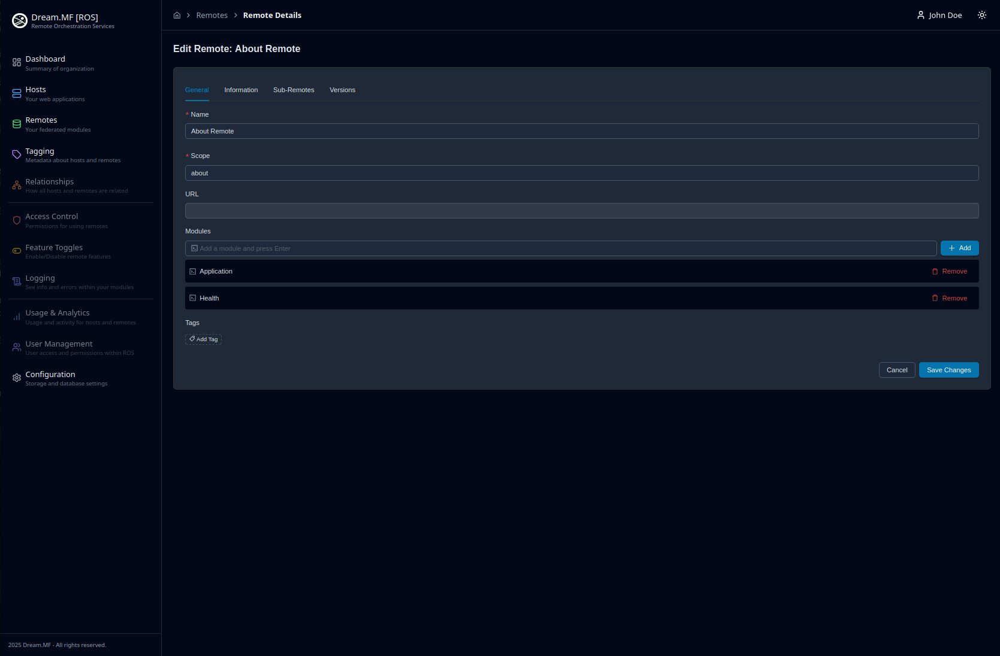
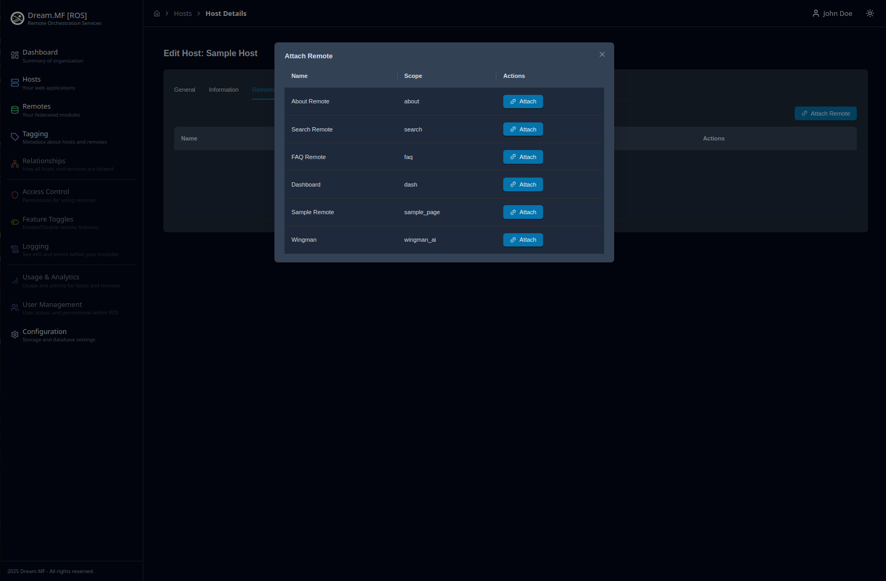

# Screenshots

### Screenshot 1: Main Dashboard

The main dashboard provides an overview of your organization's remote orchestration setup, with quick access to hosts, remotes, and other key features.

### Screenshot 2: Light Mode / Dark Mode

We even provide a lgiht mode for those who prefer a brighter experience.

### Screenshot 3: System Settings

The settings page provides access to core system configurations, including storage settings, database connections, and API configurations.

### Screenshot 4: Remote Configuration

The remote configuration page allows detailed setup of federated modules, including versioning, dependencies, and deployment settings.

